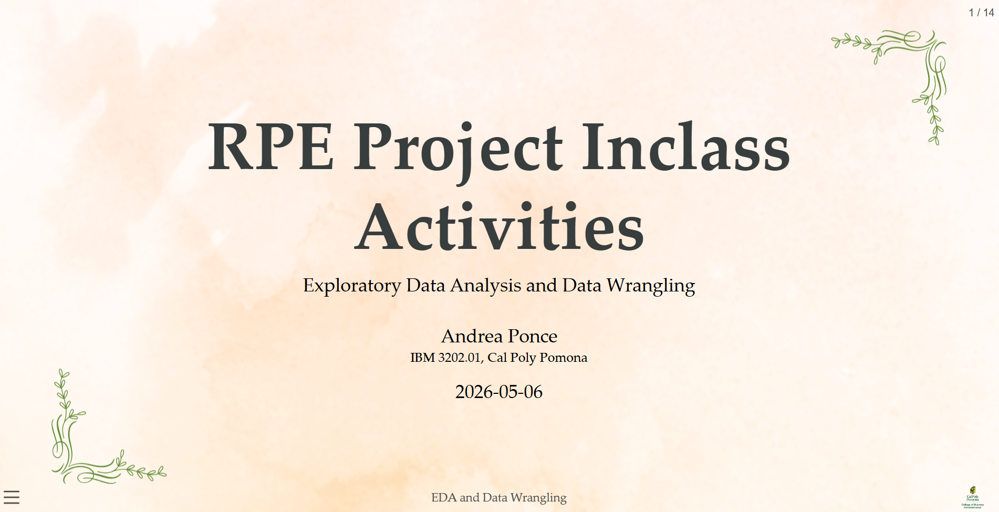
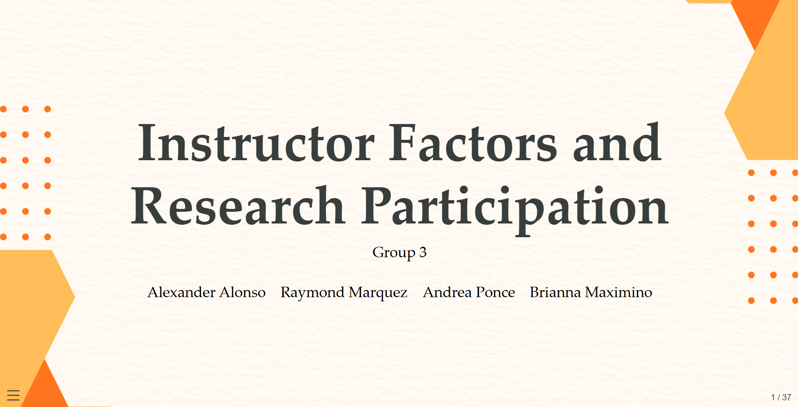

# Revealjs Presentation

This page highlights presentation projects created using Quarto and revealjs throughout the semester.

These presentations combined marketing analysis, data visualization, research findings, and professional design elements to communicate insights in an engaging format.

## Presentation Features

- Slide transitions
- Interactive presentation layouts
- Data visualizations
- Marketing analysis
- Professional formatting
- Customized themes and design

## Skills Demonstrated

- Quarto revealjs
- Presentation design
- Marketing communication
- Data storytelling
- Research presentation
- Technical formatting

## Featured Work

{width="90%" fig-align="center"}

*Example of a revealjs presentation created for an in-class RPE project activity in IBM 3202.01 at Cal Poly Pomona.*

{width="90%" fig-align="center"}

*Group research presentation analyzing instructor factors and student research participation.*