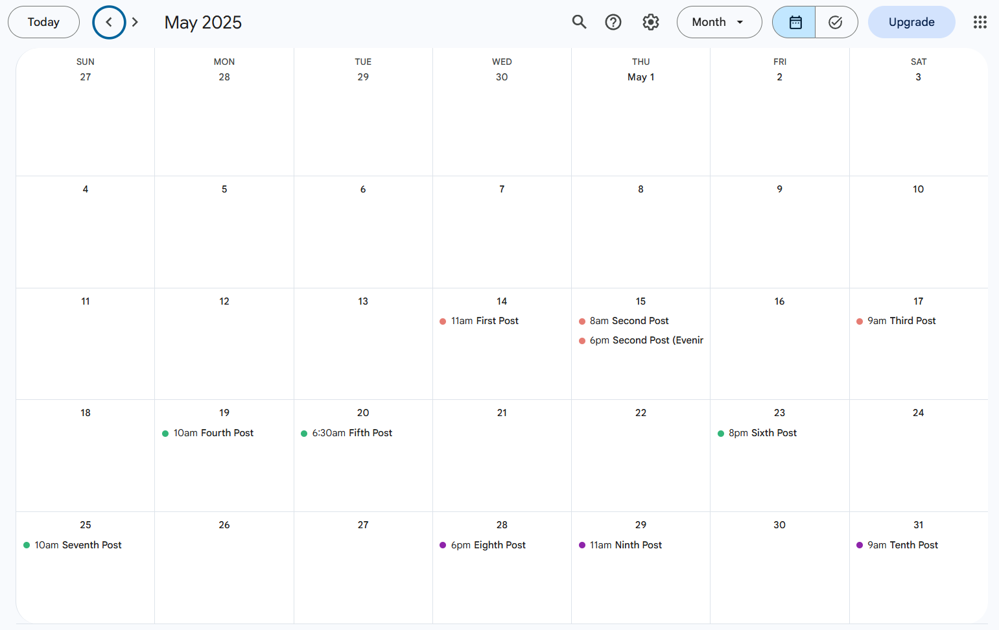
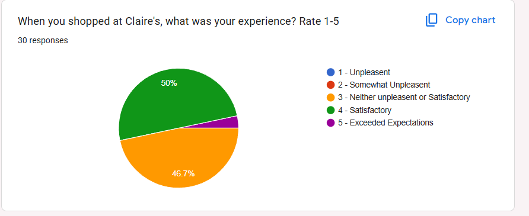
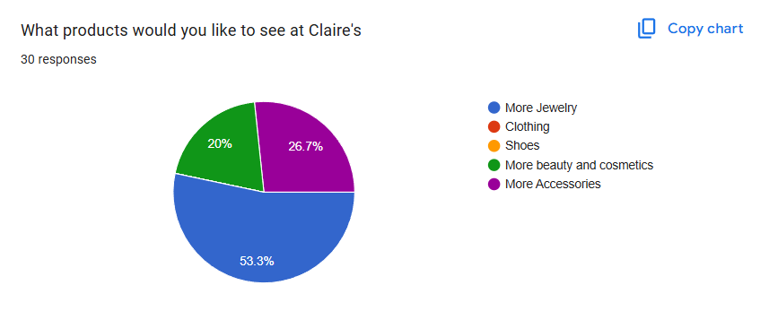
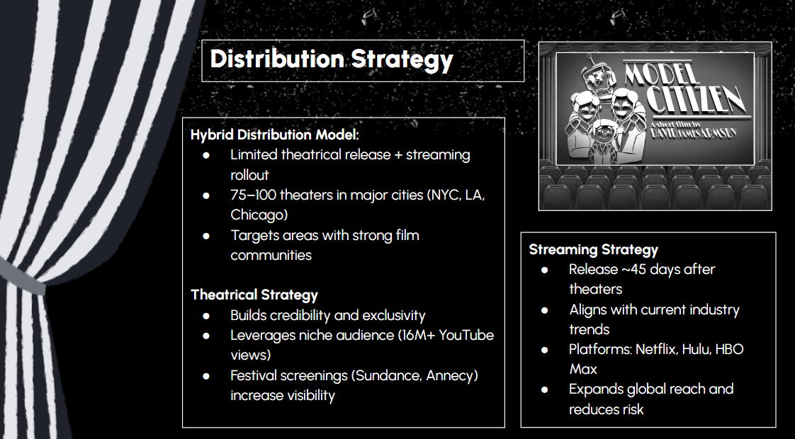
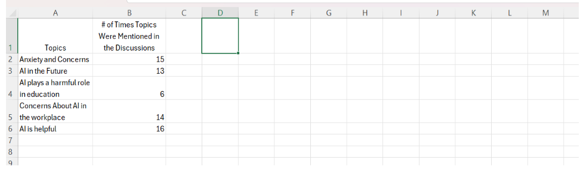
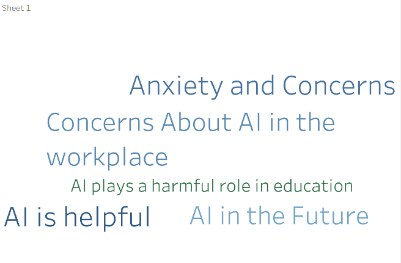

# Marketing Projects

This page highlights selected projects that demonstrate my experience with marketing analytics, digital marketing, data visualization, and content creation.

::: {.card}

## Google Analytics 4 Analysis

In this project, I used Google Analytics 4 to analyze website and user behavior. I reviewed key metrics such as users, traffic sources, engagement, and conversions to better understand how audiences interact with digital content.

**Skills used:** GA4, digital analytics, KPI analysis, marketing insights

:::

::: {.card}

## Data Visualization Dashboards

Throughout the semester, I completed multiple assignments focused on data visualization and dashboard creation. These projects involved organizing marketing and analytics data into visual formats to better identify trends, patterns, and insights.

**Skills used:** Quarto, RStudio, Tableau, dashboards, data visualization, marketing analytics

:::

::: {.card}

## Cal Poly Pomona Nursery Internship

For this internship, I worked with classmates to create a short promotional video for the Cal Poly Pomona Nursery. Our team analyzed SEO strategies and curated content to improve engagement and visibility. We also tracked analytics and presented our results to the nursery representative.

**Skills used:** content creation, teamwork, analytics, presentation skills

:::

::: {.card}

## Wellness Ranch Equine Assisted Therapy

{width=90% fig-align="center"}

*Content calendar created for Wellness Ranch Equine Assisted Therapy. This posting schedule was designed to organize social media content timing and maintain consistent audience engagement throughout the campaign.*

During my internship experience, I collaborated with other marketing students to create digital content, plan social media posts using a digital calender, and communicate with the client based on feedback.

**Skills used:** social media marketing, client communication, content planning

:::

::: {.card}

## Business Rebranding Project

{width=85% fig-align="center"}

*Survey results showing customer shopping experiences and satisfaction levels at Claire’s.*

{width=85% fig-align="center"}

*Survey responses highlighting the types of products consumers would like to see more of at Claire’s.*

This project focused on developing a rebranding strategy for Claire’s to appeal to a more mature and trend-focused audience while still maintaining the brand’s identity. The project included consumer analysis, marketing recommendations, brand positioning, and visual presentation development.

**Skills used:** branding strategy, consumer analysis, marketing research, presentation design, market positioning

:::

::: {.card}

## Short film Marketing Strategy Project

{width=85% fig-align="center"}

*Screenshot from the Model Citizen marketing project presentation. I was responsible for the distribution and marketing strategy portion of the project, including release planning, streaming strategy, and audience targeting recommendations.*

This project focused on developing a marketing and distribution strategy for the animated short film *Model Citizen*. The plan included audience targeting, promotional strategy, release planning, and social media marketing recommendations designed to expand the film into a feature-length release.

**Skills used:** marketing strategy, audience analysis, campaign planning, entertainment marketing, presentation development

:::

::: {.card}

## Tableau Data Visualization Projects

{width=85% fig-align="center"}

*Spreadsheet data created by summarizing and organizing discussion responses about generative AI into key themes and topic frequencies.*

{width=75% fig-align="center"}

*Tableau word cloud visualization created from the summarized discussion data to highlight the most common themes, concerns, and perspectives related to generative AI.*

Throughout the semester, I used Tableau to create visualizations and analyze marketing-related data. These projects included charts, trend analysis, dashboards, and data storytelling techniques used to present insights in a clear and engaging way.

**Skills used:** Tableau, data visualization, dashboard creation, trend analysis, data storytelling

:::
